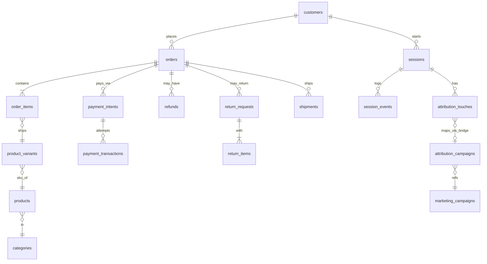
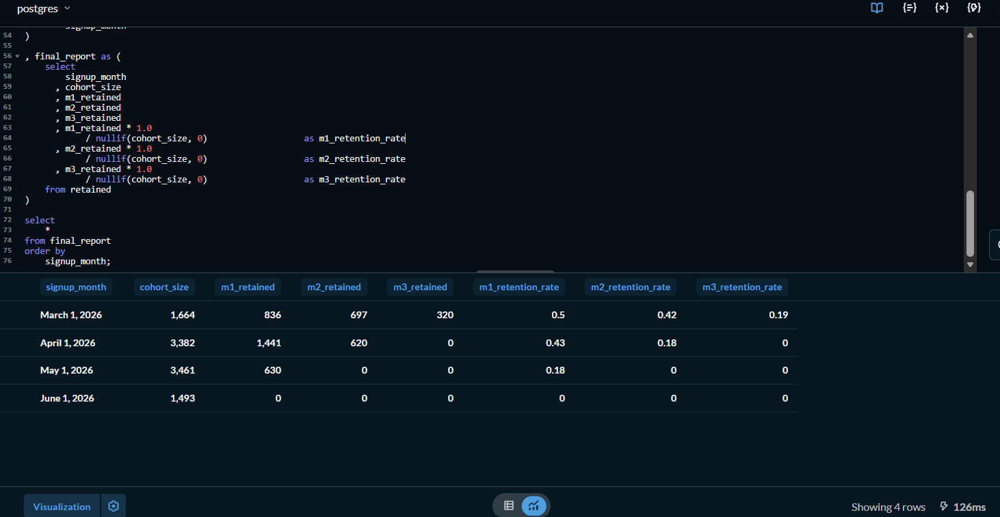
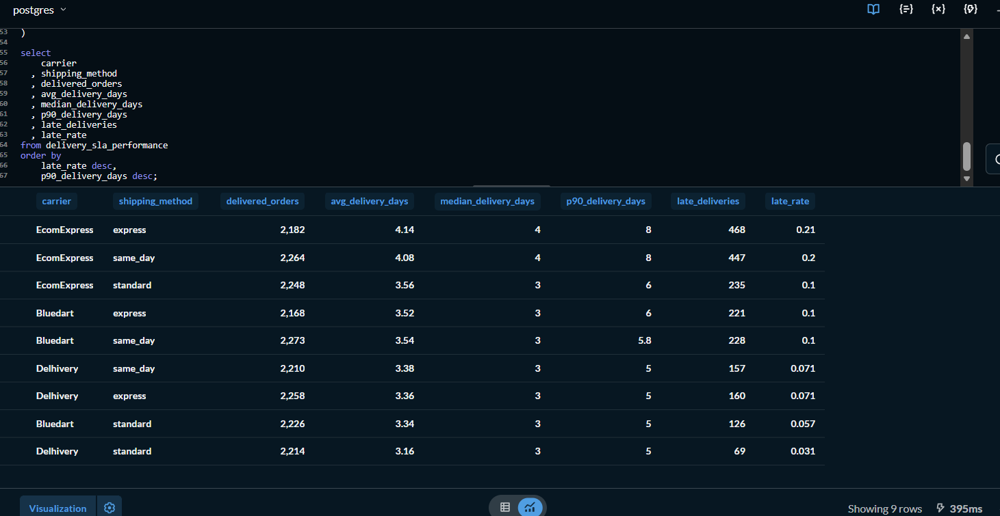
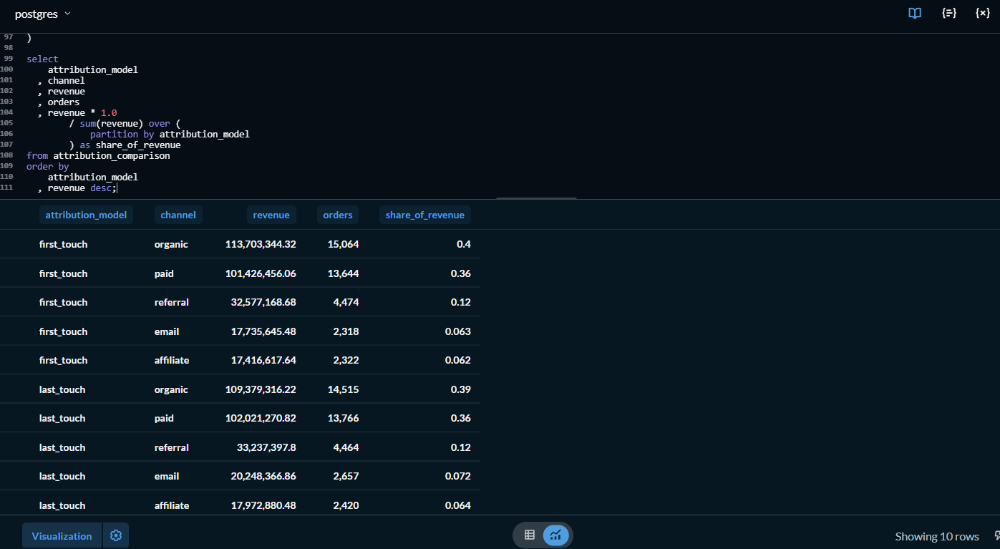

# SQL Business Insights

End-to-end ecommerce analytics project built using advanced SQL to answer business questions across revenue, retention, customer behavior, payments, logistics, and marketing attribution.

This project simulates the type of work a Business Analyst, Product Analyst, or Data Analyst would perform inside a high-growth ecommerce company.

---

## Case Study

📝 Notion Case Study:

**What 10 SQL Queries Told Me About This Business**

[[Click Here](https://app.notion.com/p/What-10-SQL-Queries-Told-Me-About-This-Business-3998b81707fa8062b97ae5c35dda915a?source=copy_link)]

The case study summarizes the major findings from the analysis and presents them as a memo to a hypothetical founder.

---

# Project Goals

The objective of this project was to answer key business questions such as:

- How is revenue trending over time?
- Are customers becoming more or less loyal?
- Which channels drive purchases?
- Which products actually generate profit?
- Where are customers dropping off?
- Which payment methods fail most often?
- Which logistics partners are hurting customer experience?
- Who are the highest-value customers?
- When should win-back campaigns be triggered?
- Which channels open the funnel versus close it?

Because eventually every company realizes that dashboards are just colorful ways of asking:

> "Why is revenue changing?"

---

# ER Diagram


---

# Repository Structure

```text
SQL-BUSINESS-INSIGHTS
│
├── screenshots
│   ├── q2_cohort_retention.png
│   ├── q7_delivery_sla.png
│   └── q10_attribution.png
│
├── notes
│   └── ecom_schema.md
│
├── queries
│   ├── 01_daily_business_summary.sql
│   ├── 02_monthly_signup_cohort_retention.sql
│   ├── 03_funnel_conversion_by_channel.sql
│   ├── 04_top_products_by_net_revenue.sql
│   ├── 05_category_health_purchases_returns.sql
│   ├── 06_payment_failure_rate.sql
│   ├── 07_delivery_sla_breach.sql
│   ├── 08_customer_ltv_bucket_share.sql
│   ├── 09_repeat_purchase_interval.sql
│   └── 10_attribution_first_vs_last.sql
│
├── INTERPRETATIONS.md
├── README.md
└── case_study_link.md
```

---

# Queries Included

| Query | Business Question |
|--------|-------------------|
| Q1 | Daily Revenue Trends |
| Q2 | Cohort Retention |
| Q3 | Funnel Conversion |
| Q4 | Top Products by Net Revenue |
| Q5 | Category Health |
| Q6 | Payment Failure Analysis |
| Q7 | Delivery SLA Breaches |
| Q8 | Customer Lifetime Value |
| Q9 | Repeat Purchase Interval |
| Q10 | First vs Last Touch Attribution |

---
# Sample Query Outputs

## Cohort Retention Analysis

Customer retention dropped from 50% in March cohorts to 18% in May cohorts.



---

## Delivery SLA Analysis

EcomExpress contributes over half of all late deliveries.



---

## Attribution Comparison

Email gains share under Last-Touch attribution.



---

# Major Findings

### 1. Revenue is highly concentrated.

Customers with lifetime value above ₹20K generate approximately:

```text
88% of total revenue
```

This business is heavily dependent on a relatively small group of customers.

---

### 2. Customer retention deteriorated sharply.

Month-1 retention declined from:

```text
50% (March cohort)
↓
18% (May cohort)
```

This suggests acquisition quality or onboarding effectiveness has materially worsened.

---

### 3. Checkout is not the bottleneck.

Checkout conversion rates remain very healthy:

```text
85% - 87%
```

The largest funnel drop occurs between:

```text
Product View → Add To Cart
```

Only about:

```text
40%
```

of product viewers add an item to their cart.

---

### 4. Logistics performance differs dramatically.

EcomExpress contributes more than:

```text
54%
```

of all late deliveries despite representing only one carrier.

Premium shipping methods also appear to provide little performance improvement.

---

### 5. Email primarily closes sales.

Email revenue attribution increases from:

```text
₹17.7M
→
₹20.2M
```

under Last-Touch attribution.

This suggests Email acts primarily as a conversion and retention channel rather than an acquisition channel.

---

# Data Quality Findings

The analysis surfaced several issues that would require attention before production reporting:

- Mixed-case values in `orders.status`
- Multiple missing-value representations in customer geography columns
- Revenue definition mismatch between `orders.total` and `order_items`
- Event tracking starts only on `2026-04-19`
- Large volume of same-day repeat purchases
- Predominantly single-touch attribution journeys
- Several tables were sparsely populated or partially unused


---

# How To Run

### Environment

- Database: PostgreSQL
- Schema: `ecom`
- Query Tool: Internal Metabase instance

### Steps

1. Open the internal Metabase server.
2. Connect to the PostgreSQL datasource.
3. Select the `ecom` schema.
4. Open any SQL editor window.
5. Copy and execute queries from the `/queries` folder.

Most queries are independent and can be executed individually.

A few assumptions used across the project:

- Cancelled orders are excluded from revenue analyses.
- Only paid orders contribute to realized revenue.
- In-transit shipments are excluded from SLA calculations.
- Same-day repeat orders are analyzed separately.
- Orders without attribution are bucketed into `Direct`.

---

# Skills Demonstrated

### SQL

- CTEs
- Window Functions
- Cohort Analysis
- Percentiles
- Funnel Analytics
- Attribution Modeling
- Revenue Allocation
- Conditional Aggregations
- Top-N-per-Group
- Retention Analytics

### Business Analytics

- Customer Lifecycle Analysis
- Product Analytics
- Operational Analytics
- Marketing Attribution
- LTV Modeling
- Logistics Performance Analysis
- Executive Reporting

---

# Files Worth Reading

| File | Description |
|------|-------------|
| `INTERPRETATIONS.md` | Business interpretation of all 10 analyses |
| `notes/ecom_schema.md` | Schema notes and table relationships |
| `queries/` | All SQL analyses |
| Notion Case Study | Executive memo summarizing findings |

---

# Reflection

### What I learned

Building analytical queries is only half the work. The harder part is deciding what metrics actually mean and ensuring business definitions remain consistent across analyses.

### What I would do differently

I would create a formal metric layer earlier in the project. Several iterations were spent reconciling revenue definitions and handling cancelled orders consistently.

### Biggest surprise

The largest insights came from data quality problems rather than the queries themselves.

### Most valuable takeaway

Small modeling decisions, such as whether same-day purchases count as repeat behavior, can materially change business conclusions.

### Next step

I would extend this project into dashboarding and predictive analytics by building churn prediction and customer segmentation models.

---

## Author

**Prathamesh D S**

Aspiring Data Analyst focused on SQL, Product Analytics, and Business Intelligence.

LinkedIn: [Prathamesh D S](https://www.linkedin.com/in/prathameshds/)

Case Study:
[What 10 SQL Queries Told Me About This Business](https://app.notion.com/p/What-10-SQL-Queries-Told-Me-About-This-Business-3998b81707fa8062b97ae5c35dda915a?source=copy_link)
